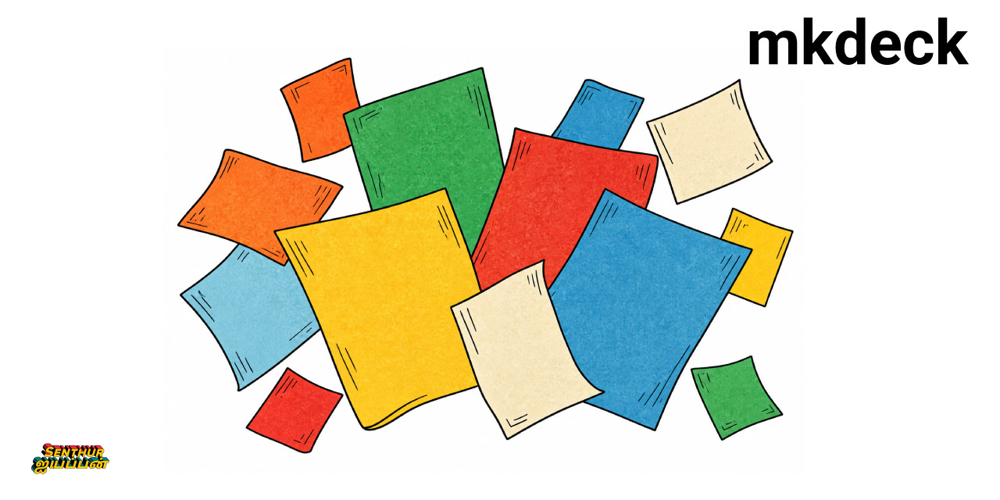

# mkdeck

mkdeck turns a Markdown file or a Python script into a slide deck. The deck is one HTML page that runs in any browser.

## What mkdeck is

A deck is one Markdown file, one small settings file, and a folder of figures. mkdeck builds them into an HTML page. It also serves that page on your computer and reloads it when you save a file.

mkdeck needs only Python 3.11 or newer. reveal.js, KaTeX, and the Roboto font ship inside the package, so you do not install Node.

## Who it is for

mkdeck is for people who know Markdown and Python basics and want slides quickly. It suits researchers and engineers who show measured results next to a sentence that explains them.

## What you can do

- Write slides in Markdown, or generate them from Python.
- Show live figures, such as a Plotly chart or a WebGL scene.
- Play Brax robot runs offline.
- Draw math with KaTeX and diagrams with Mermaid.
- Check every slide for overflow, then export a PDF.
- Restyle a deck with CSS variables, and add your own components.

A built deck works offline. Diagrams are the one exception, because Mermaid loads from a CDN unless you give it a local copy.

## Where to start

1. [Install mkdeck](start/install.md), then [make your first deck](start/first-deck.md).
2. [Learn the slide format](write/slide-basics.md) to write slides.
3. [Show robot runs](robots/convert.md) if you use Brax.
4. [Build and share](share/build.md) your deck as a folder, a single file, or a PDF.
5. [Build a deck from Python](python/build-a-deck.md) when your slides report computed numbers.
6. [Extend a deck](extend/css.md) with your own colors, fonts, and components.
7. Look up a command in the [CLI reference](reference/cli.md) or a class in the [API reference](api.md).
