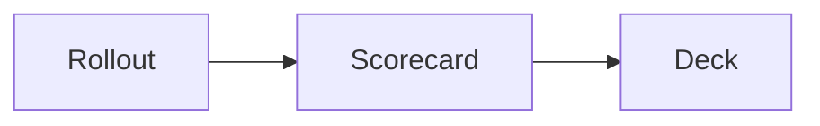

# Diagrams

Draw a diagram with a `mermaid` code fence.

````markdown

````

mkdeck turns the fence into a diagram that Mermaid draws in the browser.

## How diagrams load

Mermaid is a large library, so mkdeck does not bundle it. Instead, mkdeck loads a pinned release from a CDN when a slide with a diagram is on screen or next to it. The release is `mermaid@12.0.0` from `cdn.jsdelivr.net`, and mkdeck checks it against its SRI hash.

As a result, a diagram needs a network connection, both in the browser and in `mkdeck export`. A deck without a diagram works offline.

## Draw a diagram offline

To work offline, save `mermaid.min.js` under `assets/` in your deck folder, and then write the element yourself. The `data-src` attribute names the copy to load, and mkdeck loads that file as it is:

```html
<deck-mermaid data-src="assets/mermaid.min.js">
flowchart LR
  A[Rollout] --> B[Deck]
</deck-mermaid>
```

## Limits

!!! note
    mkdeck loads Mermaid once for the whole deck, so the first diagram that loads decides which copy every diagram uses.

    `mkdeck check` flags a diagram that did not draw. See [Check your slides](../share/check.md).

Next: [Figures](figures.md).
