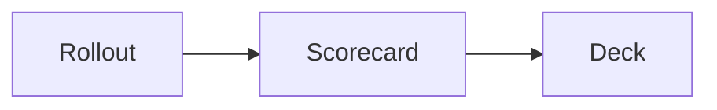

# Writing slides

A deck is one Markdown file. The frontmatter holds the deck settings. A `---`
separator on its own line starts each slide.

```markdown
---
title: "Barkour vault: model mismatch and open problems"
date: "2026-09-16"
theme: minimal
---

---

The Go2 finishes standing on the 0.60 m crate. The Barkour model stops against
the near face.

---

# Results
```

mkdeck adds an opening title slide from `title` and `date`. If the deck starts
with its own title slide, mkdeck uses that one instead.

## What a slide holds

Write the message as one sentence. Add one kind of supporting content. A slide
that carries a single message reads better than a slide that carries three.

| Content | How you write it |
| --- | --- |
| Sentence | A paragraph |
| Bullets | A `-` list, or a definition list |
| Display math | `$$ ... $$` on its own line |
| Inline math | `$ ... $` inside the sentence |
| Figure | `` |
| Two figures | Both images inside a `::: figures` block |
| Table | A GFM table with pipes |
| Diagram | A `mermaid` code fence |
| Notes | `<!-- notes: say this out loud -->` |
| Heading | `#`, which makes the slide a title slide |

## Slide options

An HTML comment at the top of a slide sets the options of that slide:

```markdown
---
<!--
id: departure
layout: statement
classes: [dense]
-->

Five of five seeds cross the wall at 22 N m.
```

| Option | Meaning |
| --- | --- |
| `id` | A stable name, written to `data-id`. Use it to find a slide again |
| `layout` | `auto`, `title`, `statement`, `figures` or `table` |
| `title` | The heading, drawn on a title slide |
| `sentence` | The message, if you prefer to set it here |
| `bullets` | A list of strings |
| `math` | A list of display formulas |
| `notes` | Speaker notes |
| `date` | On a title slide, the date that restamps every later slide |
| `classes` | Extra CSS classes. `dense` tightens a large table |

Leave `layout` at `auto` in most decks. Figures win over a table, and a slide
with neither is a statement.

## Figures

An image link becomes a figure. The file suffix decides how mkdeck draws it:

- `.html` or `.htm` becomes an iframe. Use this for a Plotly chart or any
  interactive page.
- `.rollout` or `.rbundle` becomes a robot run, drawn by the rollout viewer.
  See [Rollouts](#rollouts).
- Every other suffix becomes an image. Use this for a PNG, an SVG or a GIF.

The link text becomes the caption above the frame:

```markdown

```

Two figures sit side by side inside a `figures` block:

```markdown
::: figures


:::
```

A slide holds at most two figures. Move a third figure to a new slide.

Keep the files under the deck folder. mkdeck copies that folder into the build,
so the deck stays self-contained. An `http` or `https` URL also works.

### Large embeds stay fast

mkdeck loads the iframe of the current slide, and lets the browser prefetch the
neighbours. Every other iframe holds `about:blank` until you reach it. A deck of
57 slides and many megabytes of WebGL pages still answers a keypress at once.

Press `R` during a talk to reload the figures on the slide you are on. Use it
when a viewer stalls.

## Rollouts

A Brax playback page carries its whole world inline: every mesh, and six
libraries fetched from a CDN when the slide opens. One robot over thirty slides
means thirty copies of that robot and no deck at all without the network.

`mkdeck rollout` splits them apart. The meshes of one model go into a shared
file; each run keeps only its poses.

```bash
mkdeck rollout runs/*.html -o slides/assets
```

Then link the result like any other figure:

```markdown

```

On a real deck of 39 runs this turned 464 MB of pages into 15.8 MB, with no
loss: every triangle is kept and the poses are the ones Brax recorded.

A rollout plays when its slide arrives and follows the robot, so a run that
travels stays in frame. Hover it for the play button and the scrub bar. The
element takes a few options:

| attribute | what it does |
| --- | --- |
| `data-autoplay="false"` | wait to be played |
| `data-loop="false"` | stop at the end instead of starting over |
| `data-follow="false"` | hold the camera still |
| `data-view="iso\|side\|front\|top"` | the camera it opens on |
| `data-scale="2.4"` | the world height the viewport spans, in metres |

An `.rbundle` pushed to an artifacts server plays too, unconverted — it is the
same format, whole rather than split.

### Shipping a deck of rollouts

A browser will not read a neighbouring file from a `file://` page, so a folder
build has to be served. Build one file instead and the deck carries its
rollouts and its viewer inside the document:

```bash
mkdeck build slides -o out/deck.html --single-file
```

That file opens from a USB stick or an email attachment with nothing fetched.
The deck above comes to about 21 MB, since the binaries carry a third more as
text.

A deck that holds no rollout carries neither the viewer nor three.js.

## Numbers

mkdeck marks a number in a darker ink, because a reader looks for the numbers
first. A number keeps its unit, so `22 N m` is marked as one value. A number
inside a word is left alone, so the `2` in `Go2` stays grey.

These units are recognised by default:

```
N m s/rad, kg m^2, rad/s, body weights, N m, mm, ms, Hz, kg, m, s,
percent, degrees
```

Set your own list in `deck.yml`. Write the longer spelling first, so `N m`
matches before `m`:

```yaml
units:
  - N m
  - mm
  - s
```

## Deck settings

`deck.yml` sits beside the Markdown file. The frontmatter of the deck wins over
this file, so you can keep shared settings here and override them per deck.

| Key | Meaning |
| --- | --- |
| `title` | The deck title |
| `date` | The date on the title slide and in the corner of every slide |
| `theme` | `minimal` or `dark` |
| `units` | The units the number marking recognises |
| `extra_css` | Your stylesheets, linked after the theme |
| `extra_js` | Your scripts, loaded after `mkdeck.js` |
| `reveal` | Options merged into `Reveal.initialize` |
| `title_slide` | `false` to drop the generated title slide |

See [Extending a deck](extending.md) for `extra_css` and `extra_js`.

## Math and diagrams

KaTeX renders the math when the deck is built, so the formula needs no network:

```markdown
$$r_1 = r_0 - 0.1\,C_{\text{ori}}$$

A pitch band is added. The target pitch is 0 to 75 degrees while the robot rises.
```

A `mermaid` fence becomes a diagram:

````markdown

````

Mermaid is a large library, so mkdeck fetches it from a CDN, and only when a
deck holds a diagram. A deck without a diagram works offline.

To draw a diagram offline, save `mermaid.min.js` in your deck folder and write
the element yourself. The `data-src` attribute names the copy to load:

```html
<deck-mermaid data-src="assets/mermaid.min.js">
flowchart LR
  A[Rollout] --> B[Deck]
</deck-mermaid>
```

## Raw HTML

Markdown passes HTML through. Use it for your own elements:

```markdown
Departure speed reaches <deck-mark type="circle">2.10 m/s</deck-mark> at 22 N m.
```

The `html` field of the slide model replaces the whole slide body. It is the
escape hatch for a layout the model does not cover.
