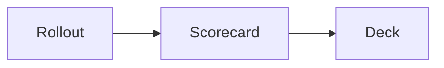

# Writing slides

A deck is one Markdown file. The frontmatter holds the deck settings. A `---`
separator on its own line starts each slide.

```markdown
---
title: "Barkour vault: model mismatch and open problems"
date: "2026-09-16"
theme: minimal
---

---

The Go2 finishes standing on the 0.60 m crate. The Barkour model stops against
the near face.

---

# Results
```

mkdeck adds an opening title slide from `title` and `date`. If the deck starts
with its own title slide, mkdeck uses that one instead.

A separator is a line of three or more dashes, alone on its line. It cuts the
slide wherever it sits, including right under a paragraph. mkdeck ignores it
inside a fenced code block, an HTML comment and a `$$` block, where a line of
dashes is part of the block.

Two rules follow from that:

- **A `---` on the first line of the file always opens the frontmatter.** If you
  want the deck to start with a slide and no settings, leave out the first
  `---`, or write an empty frontmatter block (`---` twice) before it. A file
  that opens with `---` and never closes the block is an error, not a silent
  skip.
- **Setext headings are not supported.** A line of `---` or `===` under a text
  line does not make a heading. Write headings with `#`.

## What a slide holds

Write the message as one sentence. Add one kind of supporting content. A slide
that carries a single message reads better than a slide that carries three.

| Content | How you write it |
| --- | --- |
| Sentence | A paragraph |
| Bullets | A `-` list, or a definition list |
| Display math | `$$ ... $$` on its own line |
| Inline math | `$ ... $` inside the sentence |
| Figure | `` |
| Two figures | Both images inside a `::: figures` block |
| Table | A GFM table with pipes |
| Diagram | A `mermaid` code fence |
| Notes | `<!-- notes: say this out loud -->` |
| Heading | `#`. Alone on a slide it makes a title slide; with other content it is drawn above it |

### Inline formatting

A sentence, a bullet, a figure label and a table cell take inline Markdown:
`**bold**`, `*italic*`, `` `code` `` and `[links](https://example.com)`. Math
inside `$...$` and the number marking work in the same places.

Raw HTML in those places passes through unescaped, so `<b>`, `<sup>` or your own
custom element does what you wrote. That is what you want for Markdown you
trust. If you build a deck from data in Python, escape any text you did not
write yourself, with `html.escape`, before you put it in a slide.

## Slide options

An HTML comment at the very top of a slide, right after the separator, sets the
options of that slide. mkdeck reads the first comment of a slide as options when
one of its `key:` lines names an option, or is close enough to one to be a typo
of it (`layot:` for `layout:`). Any other comment is a plain comment: it stays
invisible and is never checked, so `<!-- TODO: fix this -->` is safe. A comment
that reads as options has to be valid YAML and hold only the options below;
otherwise it is an error that names the slide.

```markdown
---
<!--
id: departure
layout: statement
classes: [dense]
-->

Five of five seeds cross the wall at 22 N m.
```

| Option | Meaning |
| --- | --- |
| `id` | A stable name, written to `data-id`. Use it to find a slide again |
| `layout` | `auto`, `title`, `statement`, `figures` or `table` |
| `title` | The heading, drawn on a title slide |
| `sentence` | The message, if you prefer to set it here |
| `bullets` | A list of strings |
| `math` | A list of display formulas |
| `notes` | Speaker notes |
| `date` | On a title slide, the date that restamps every later slide |
| `classes` | Extra CSS classes. `dense` tightens a large table |

Leave `layout` at `auto` in most decks. mkdeck picks the layout from what the
slide holds: a heading alone is a title slide, figures make a figures slide, a
table makes a table slide, and anything else is a statement.

### What a slide cannot hold

mkdeck stops with an error, and names the slide, when a slide holds something it
cannot draw. It never drops content silently. These are errors:

- figures and a table on the same slide
- two tables, or two headings
- more than two figures
- a nested list, or anything but text inside a bullet, such as a code block or
  raw HTML
- a block with no place on a slide, such as a quote
- an option that repeats what the body already says, or an option that names
  something written in the body (`embeds`, `table`, `html`)
- an unknown option, an unknown layout, or two slides with the same `id`

Move the extra content onto a new slide.

A heading is not an error. When a slide holds a heading and a body, the heading
is drawn above the body:

```markdown
# Results

Five of five seeds cross the wall.
```

The `theme` setting is checked as well: a name that has no stylesheet is an
error, not an unstyled deck.

An image inside a bullet or a table cell is drawn where you wrote it, but mkdeck
does not copy its file into the build, so a local image there is warned about
and breaks in the output. Only a paragraph made of images becomes figures and
is copied. Write the image on a line of its own.

## Figures

An image link becomes a figure. The file suffix decides how mkdeck draws it:

- `.html` or `.htm` becomes an iframe. Use this for a Plotly chart or any
  interactive page.
- `.rollout` or `.rbundle` becomes a robot run, drawn by the rollout viewer.
  See [Rollouts](#rollouts).
- Every other suffix becomes an image. Use this for a PNG, an SVG or a GIF.

The link text becomes the caption above the frame:

```markdown

```

Two figures sit side by side inside a `figures` block:

```markdown
::: figures


:::
```

A slide holds at most two figures. Move a third figure to a new slide.

Keep the files under the deck folder. mkdeck copies that folder into the build,
so the deck stays self-contained. An `http` or `https` URL also works.

### Large embeds stay fast

mkdeck loads the iframe of the current slide, and lets the browser prefetch the
neighbours. Every other iframe holds `about:blank` until you reach it. A deck of
dozens of slides and many megabytes of WebGL pages still answers a keypress at
once.

Press `R` during a talk to reload the figures on the slide you are on. Use it
when a viewer stalls.

## Rollouts

A Brax playback page carries its whole world inline: every mesh, and six
libraries fetched from a CDN when the slide opens. One robot over thirty slides
means thirty copies of that robot and no deck at all without the network.

`mkdeck rollout` splits them apart. The meshes of one model go into a shared
file; each run keeps only its poses.

```bash
mkdeck rollout runs/*.html -o slides/assets
```

Then link the result like any other figure:

```markdown

```

Every triangle is kept and the poses are the ones Brax recorded, so the
conversion loses nothing. `mkdeck rollout` prints the size of the pages it read
and the size of the rollouts it wrote, so you can see what sharing the meshes
saved on your own runs.

A rollout plays when its slide arrives and follows the robot, so a run that
travels stays in frame. Hover it for the play button and the scrub bar. The
element takes a few options:

| attribute | what it does |
| --- | --- |
| `data-autoplay="false"` | wait to be played |
| `data-loop="false"` | stop at the end instead of starting over |
| `data-follow="false"` | hold the camera still |
| `data-view="iso\|side\|front\|top"` | the camera it opens on |
| `data-scale="2.4"` | the world height the viewport spans, in metres |
| `data-background="#fff"` | the background, as a CSS colour |

A whole `.rbundle` file plays too, without converting it, whether it is stored
plain or gzip-compressed. It is the same format, whole rather than split.

### Shipping a deck of rollouts

A browser will not read a neighbouring file from a `file://` page, so a folder
build has to be served. Build one file instead and the deck carries its
rollouts and its viewer inside the document:

```bash
mkdeck build slides -o out/deck.html --single-file
```

That file opens from a USB stick or an email attachment with nothing fetched.
It is larger than the folder build, because the binary files travel as text
and grow by about a third.

A deck that holds no rollout carries neither the viewer nor three.js.

## Numbers

mkdeck marks a number in a darker ink, because a reader looks for the numbers
first. A number keeps its unit, so `22 N m` is marked as one value. A number
inside a word is left alone, so the `2` in `Go2` stays grey.

These units are recognised by default:

```
N m s/rad, kg m^2, rad/s, body weights, N m, mm, ms, Hz, kg, m, s,
percent, degrees
```

Set your own list in `deck.yml`, or as `units` in the frontmatter or on a
`Deck` in Python. The list replaces the defaults, and its order does not
matter: mkdeck tries the longest spelling first, so `N m` matches before `m`:

```yaml
units:
  - N m
  - mm
  - s
```

An empty list marks the number and none of these spellings.

## Deck settings

`deck.yml` sits beside the Markdown file. The frontmatter of the deck wins over
this file, so you can keep shared settings here and override them per deck.

| Key | Meaning |
| --- | --- |
| `title` | The deck title |
| `date` | The date on the title slide and in the corner of every slide |
| `theme` | `minimal` or `dark`. Any other name is an error |
| `units` | The units the number marking recognises |
| `extra_css` | Your stylesheets, linked after the theme |
| `extra_js` | Your scripts, loaded after `mkdeck.js` |
| `reveal` | Options merged into `Reveal.initialize` |
| `title_slide` | `false` to drop the generated title slide |

See [Extending a deck](extending.md) for `extra_css` and `extra_js`.

## Math and diagrams

KaTeX draws the math in the browser. When mkdeck builds the deck it writes a
placeholder for each formula, and the copy of KaTeX that ships inside the
package fills it in when the slide opens. Nothing is fetched, so the formulas
work offline:

```markdown
$$r_1 = r_0 - 0.1\,C_{\text{ori}}$$

A pitch band is added. The target pitch is 0 to 75 degrees while the robot rises.
```

Inline math follows the usual dollar rules. The opening `$` has no space after
it, and the closing `$` is not followed by a digit, so a sentence such as
`It costs $5 and $10.` stays text. Write `\$` for a dollar sign that must not
open a formula.

A `mermaid` fence becomes a diagram:

````markdown

````

Mermaid is a large library, so it is not bundled. mkdeck loads a pinned release
(`mermaid@12.0.0`) from `cdn.jsdelivr.net`, checked against its SRI hash, the
first time a slide with a diagram opens. A diagram therefore needs a network
connection, in the browser and in `mkdeck export`. A deck without a diagram
works offline, and `mkdeck check` flags a diagram that did not draw.

To draw a diagram offline, save `mermaid.min.js` in your deck folder and write
the element yourself. The `data-src` attribute names the copy to load, and
mkdeck then loads that file as it is:

```html
<deck-mermaid data-src="assets/mermaid.min.js">
flowchart LR
  A[Rollout] --> B[Deck]
</deck-mermaid>
```

## Raw HTML

Markdown passes HTML through, unescaped. An element you write is kept as you
wrote it, and the text around it is still rendered:

```markdown
Departure speed reaches <deck-mark type="circle">2.10 m/s</deck-mark> at 22 N m.
```

The `html` field is drawn with the rest of the slide. It is the escape hatch
for a layout the model does not cover.
